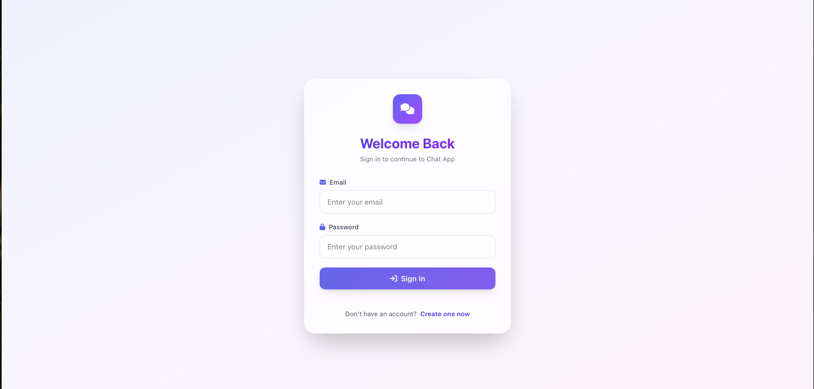
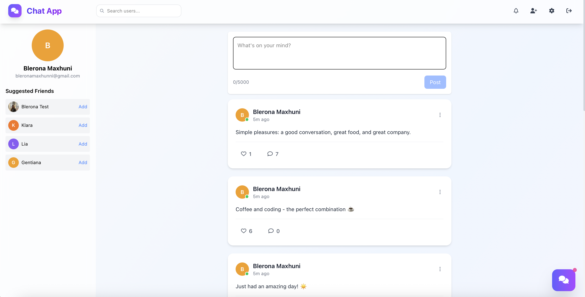
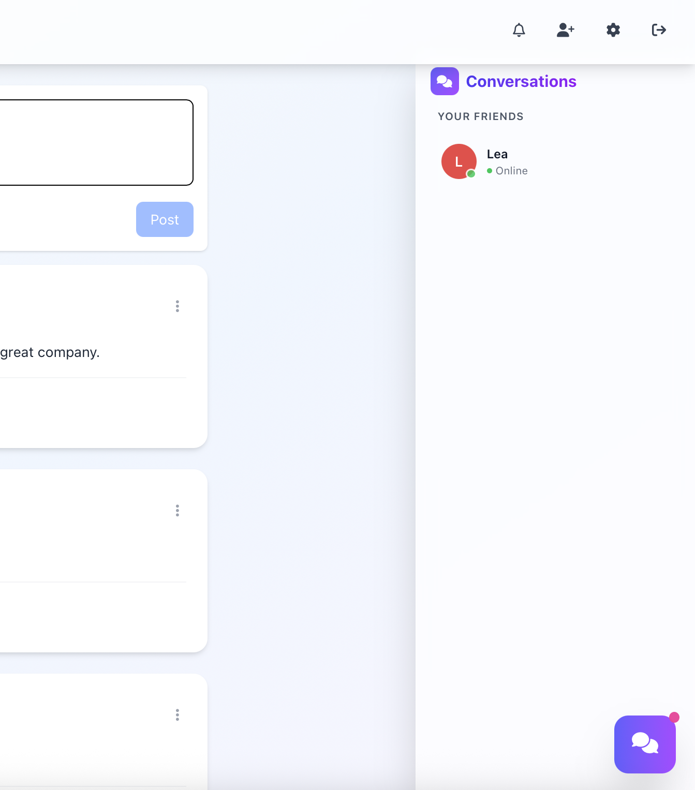
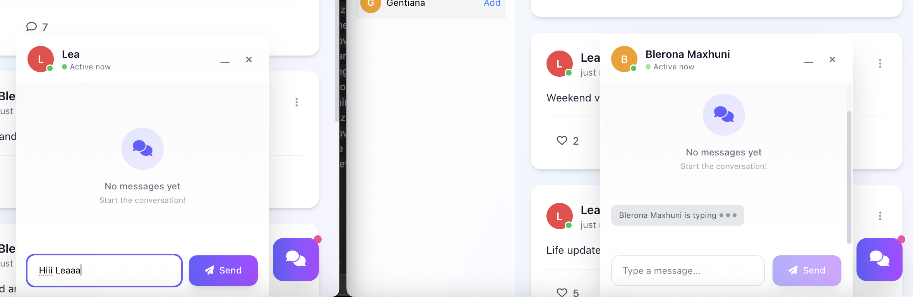
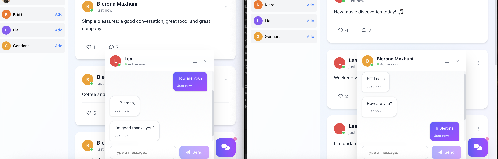
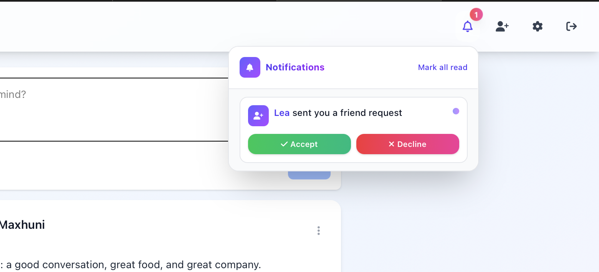
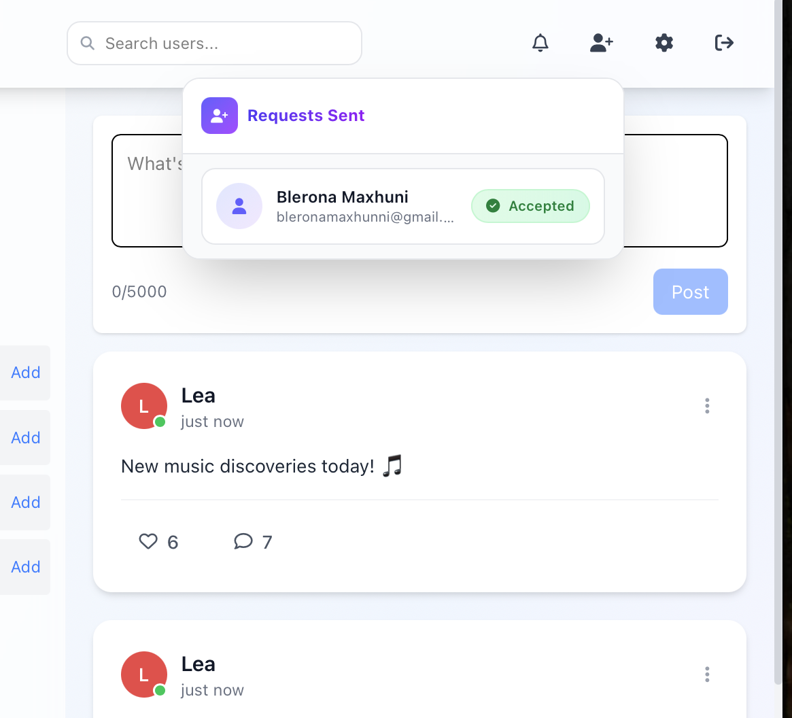
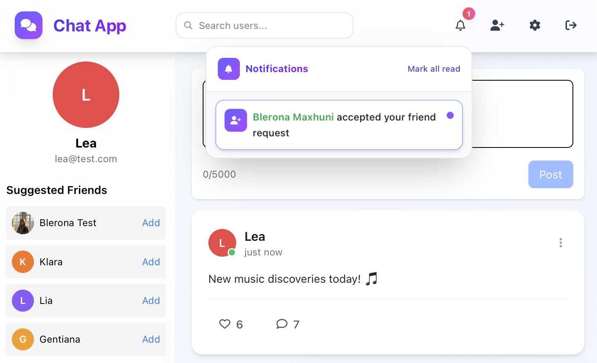

# Chat App

A modern, real-time chat application built with Laravel and Vue.js, featuring messaging, friendships, social feed, and real-time notifications.

## Features

### 💬 Real-time Messaging
- One-on-one conversations with friends
- Real-time message delivery using WebSockets (Pusher)
- Typing indicators
- Message read receipts (mark as seen)
- Last seen status tracking

### 👥 Friendships
- Send, accept, and reject friend requests
- Suggested friends based on connections
- Friend search functionality
- Real-time friend request notifications

### 📱 Social Feed
- Create and share posts
- Like and comment on posts
- Real-time updates for new posts and interactions

### 🔔 Notifications
- Real-time notifications for:
  - Friend requests
  - New messages
  - Post interactions (likes, comments)
- Mark notifications as read
- Notification center with unread count

### 👤 User Profiles
- Profile image upload
- Update profile information
- Change password
- View user status (online/offline, last seen)

## Screenshots

### Login/Register

### Main Chat App View

### Conversations

### Real-time Messaging

### Chats Between Friends

### Real-time Notifications

### Friend Request Notifications

### Friend Accepted Notifications

## Tech Stack

### Backend
- **Laravel 12** - PHP framework
- **PHP 8.2+** - Programming language
- **JWT Authentication** - Secure API authentication
- **Laravel Broadcasting** - Real-time event broadcasting
- **Pusher** - WebSocket service for real-time features
- **SQLite** - Database (can be configured for MySQL/PostgreSQL)
- **L5-Swagger** - API documentation with Swagger/OpenAPI

### Frontend
- **Vue.js 3** - Progressive JavaScript framework
- **Vue Router** - Client-side routing
- **Pinia** - State management
- **Tailwind CSS 4** - Utility-first CSS framework
- **Laravel Echo** - WebSocket client
- **Axios** - HTTP client
- **Vite** - Build tool

API documentation is available via **Swagger** at `/api/documentation`.
